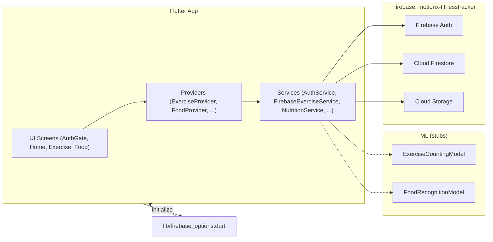
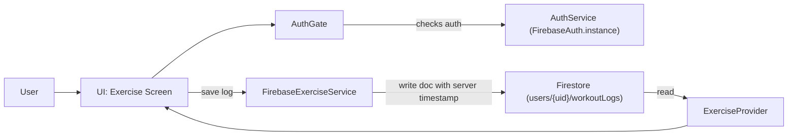

# Fitness Tracker (MotionX)

Flutter fitness tracker app to log workouts and meals.
## Features

- Email/password authentication (Firebase Auth)
- Workout logging + stats (Cloud Firestore under `users/{uid}/workoutLogs`)
- Meal/nutrition logging (Cloud Firestore)
- Profile picture upload (Firebase Storage)

## Prerequisites

- Flutter SDK installed and working (`flutter doctor`)
- A Firebase project (this repo is configured for `motionx-fitnesstracker` via FlutterFire)

## Running the app

```bash
flutter pub get
flutter run
```

Hot reload: `r` | Hot restart: `R`

## Architecture Diagrams

### High-level Architecture



### Workout Log Data Flow



### Firebase (quick)

- **Project ID:** motionx-fitnesstracker
- **Init file:** `lib/firebase_options.dart` (used in `lib/main.dart` via `Firebase.initializeApp(...)`)

## Firebase setup

- Ensure `lib/firebase_options.dart` exists (generated by FlutterFire CLI).
- Android: place `google-services.json` in `android/app/` (already present in this repo).
- iOS: add `GoogleService-Info.plist` to `ios/Runner` if targeting iOS.
- The app initializes Firebase in `lib/main.dart` with `DefaultFirebaseOptions.currentPlatform`.

## Dev commands

```bash
flutter pub get
flutter run
flutter build apk   # build release for Android
flutter test        # run unit/widget tests
```


